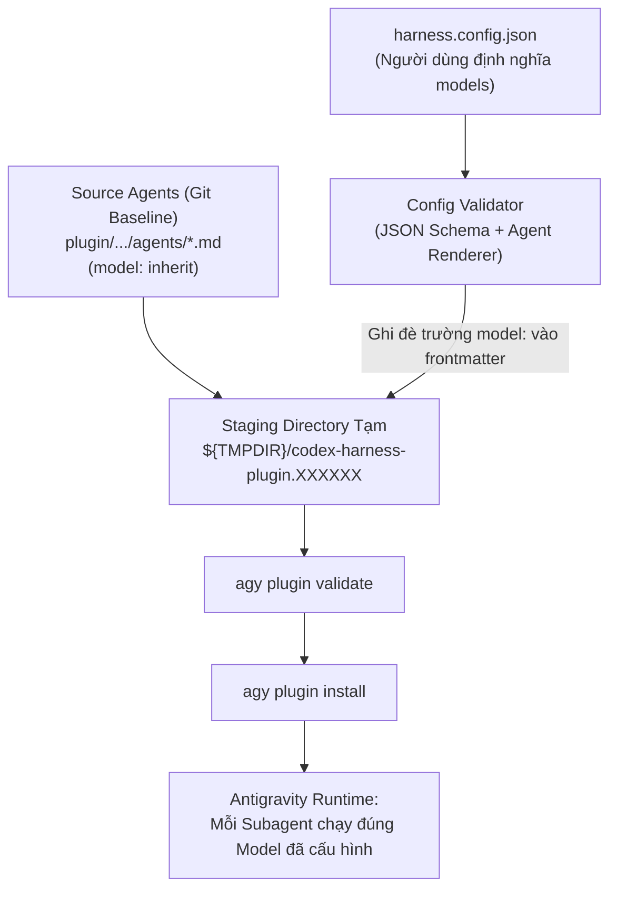

# Kế hoạch kỹ thuật: Cấu hình Model linh hoạt cho từng Subagent trong Antigravity Harness

**Ngày lập:** 11/09/2026  
**Trạng thái:** Đã hoàn thành triển khai & Kiểm chứng (Implemented & Verified)  
**Tài liệu tham chiếu liên quan:**
- [`docs/architecture.md`](file:///Users/macbook/workspace/anti_codex_test/docs/architecture.md)
- [`schemas/harness.config.schema.json`](file:///Users/macbook/workspace/anti_codex_test/schemas/harness.config.schema.json)
- [`scripts/render-mcp-config.js`](file:///Users/macbook/workspace/anti_codex_test/scripts/render-mcp-config.js)
- [`install.sh`](file:///Users/macbook/workspace/anti_codex_test/install.sh) và [`install.ps1`](file:///Users/macbook/workspace/anti_codex_test/install.ps1)

---

## 1. Hiện trạng & Định vị bài toán (Current State & Problem Statement)

### 1.1. Tóm tắt so sánh Hiện trạng (As-Is) và Đích đến (To-Be)

| Hạng mục | Hiện trạng (As-Is) | Đích đến (To-Be) |
| :--- | :--- | :--- |
| **Cấu hình Declarative** | `harness.config.json` và JSON Schema chỉ hỗ trợ cấu hình MCP (`mcp.servers.*`), hoàn toàn chưa có block cấu hình `agents`. | Bổ sung block `agents` với `defaultModel` và mapping `models` cho từng subagent vào JSON Schema và cấu hình. |
| **Model Subagent** | Toàn bộ 7 subagent bị gán cứng `model: inherit` trong frontmatter, không thể tùy biến theo đặc thù tác vụ. | Cho phép tùy biến model linh hoạt cho từng subagent (Flash Lite, Flash, Pro, hoặc model ID cụ thể). |
| **Staging & Render Pipeline** | Quá trình cài đặt chỉ có `scripts/render-mcp-config.js` xử lý cấu hình MCP; chưa có renderer cho agent frontmatter. | Bổ sung script mới `scripts/render-agent-config.js`, tích hợp vào `install.sh` (`prepare_plugin_source`) và `install.ps1` (`Resolve-HarnessPluginInstallSource`). |
| **An toàn Git Worktree** | File nguồn gốc trong repo có `model: inherit`. | File nguồn trong repo giữ nguyên `model: inherit` làm canonical baseline; toàn bộ việc áp model diễn ra tại thư mục staging tạm. |

### 1.2. Hiện trạng hệ thống chi tiết
Hiện tại, toàn bộ 7 subagent chuyên biệt của harness trong [`plugin/codex-claude-harness/agents/`](file:///Users/macbook/workspace/anti_codex_test/plugin/codex-claude-harness/agents) đều đang được gán cứng (hardcoded) trường model trong YAML frontmatter:
- [`harness-researcher.md`](file:///Users/macbook/workspace/anti_codex_test/plugin/codex-claude-harness/agents/harness-researcher.md): `model: inherit`
- [`harness-implementer.md`](file:///Users/macbook/workspace/anti_codex_test/plugin/codex-claude-harness/agents/harness-implementer.md): `model: inherit`
- [`harness-reviewer.md`](file:///Users/macbook/workspace/anti_codex_test/plugin/codex-claude-harness/agents/harness-reviewer.md): `model: inherit`
- [`harness-verifier.md`](file:///Users/macbook/workspace/anti_codex_test/plugin/codex-claude-harness/agents/harness-verifier.md): `model: inherit`
- [`harness-documenter.md`](file:///Users/macbook/workspace/anti_codex_test/plugin/codex-claude-harness/agents/harness-documenter.md): `model: inherit`
- [`harness-security-auditor.md`](file:///Users/macbook/workspace/anti_codex_test/plugin/codex-claude-harness/agents/harness-security-auditor.md): `model: inherit`
- [`harness-db-architect.md`](file:///Users/macbook/workspace/anti_codex_test/plugin/codex-claude-harness/agents/harness-db-architect.md): `model: inherit`

Khi người dùng khởi chạy phiên làm việc với model cao cấp (ví dụ: `gemini-3.8-flash-high`), toàn bộ subagent con khi được kích hoạt thông qua `invoke_subagent` đều kế thừa chính model đó.

### 1.3. Vấn đề phát sinh
1. **Lãng phí tài nguyên và quota:** Các tác vụ mang tính cơ học, hẹp như `harness-verifier` (chỉ chạy lệnh test/lint và đọc output stdout) hay `harness-documenter` (viết ghi chú release, định dạng docs) không nhất thiết phải tiêu tốn quota và latency của model suy luận mạnh nhất (`high reasoning effort`).
2. **Thiếu linh hoạt phân bổ sức mạnh:** Người dùng không thể cấu hình các tác vụ quan trọng (như `harness-reviewer` hoặc `harness-security-auditor`) chạy model chuyên sâu (ví dụ: model Pro hoặc reasoning high), trong khi cho `harness-researcher` hoặc `harness-verifier` chạy model tốc độ cao (ví dụ: Flash tiêu chuẩn hoặc Flash medium) để giảm độ trễ phản hồi.
3. **Cơ chế cấu hình chưa hoàn thiện:** Trong khi module MCP đã có cấu hình hoàn chỉnh qua [`harness.config.example.json`](file:///Users/macbook/workspace/anti_codex_test/harness.config.example.json) và [`schemas/harness.config.schema.json`](file:///Users/macbook/workspace/anti_codex_test/schemas/harness.config.schema.json), thì module Agent chưa có cơ chế cho phép người dùng khai báo model mong muốn.

### 1.4. Mục tiêu (Goals)
- Cho phép người dùng cấu hình model riêng cho từng subagent (hoặc model mặc định chung cho toàn bộ subagent) thông qua file cấu hình declarative (`harness.config.json`).
- Cho phép pick từ danh sách model có sẵn của tài khoản / hệ thống (hỗ trợ cả model ID cụ thể như `gemini-3.8-flash-high`, `gemini-3.7-flash-high`, `gemini-2.5-pro` và alias/tier như `inherit`, `flash_lite`, `flash`, `pro`).
- Đảm bảo an toàn tuyệt đối cho Git worktree: Các file nguồn gốc trong `plugin/codex-claude-harness/agents/*.md` giữ nguyên `model: inherit` làm canonical baseline, việc áp cấu hình model diễn ra trong quá trình staging khi cài đặt (`install.sh` / `install.ps1`).

### 1.5. Ngoài phạm vi (Non-Goals)
- Không can thiệp vào binary đóng gói của Antigravity CLI (`agy`).
- Không phá vỡ định dạng YAML frontmatter chuẩn của Antigravity Subagent spec.
- Không tự ý hạ model khi người dùng không yêu cầu (giữ nguyên mặc định `inherit` để đảm bảo 100% tương thích ngược).

---

## 2. Kiến trúc giải pháp (Technical Architecture)

### 2.1. Cơ chế thực thi của Antigravity CLI
Antigravity CLI nạp cấu hình subagent từ các file Markdown (`*.md`) khi plugin được cài đặt thông qua lệnh `agy plugin install <path>`. Tại runtime, công cụ `invoke_subagent` khởi tạo subagent dựa trên cấu hình khai báo trong plugin đó.

Do đó, cách tiếp cận chuẩn xác và an toàn nhất (tương tự như cách repository xử lý `mcp_config.json`) là: **Staging-time Configuration Rendering**.



### 2.2. So sánh các phương án thiết kế

| Tiêu chí | Phương án A (Khuyến nghị): Mở rộng `harness.config.json` + Staging Renderer | Phương án B: Biến môi trường (`HARNESS_AGENT_MODEL_*`) | Phương án C: File riêng `harness.agents.json` |
| :--- | :--- | :--- | :--- |
| **Tính đồng bộ** | Thống nhất 1 file config duy nhất cho cả MCP và Agents | Tách rời, dễ trùng lặp hoặc quên export | Tạo thêm file rác trong workspace |
| **IDE Auto-completion** | Có JSON Schema (`$schema`), tự gợi ý phím và validate lỗi | Không có | Cần tạo thêm schema riêng |
| **An toàn Git** | File config người dùng nằm ngoài repo hoặc được `.gitignore` | An toàn | An toàn |
| **CI/CD Tương thích** | Dễ quản lý bằng các file profile JSON (`harness.ci.json`) | Tiện cho one-liner bash | Cần quản lý file riêng |

**Quyết định:** Chọn **Phương án A làm kiến trúc chính**, đồng thời cho phép cờ CLI / Environment variables ghi đè (override) trong `install.sh` khi cần chạy kiểm thử tự động hoặc CI.

---

## 3. Đặc tả Cấu hình Chi tiết (Configuration Specification)

### 3.1. Cấu trúc mở rộng của `harness.config.json` (Đặc tả cấu hình dự kiến - Target / To-Be Spec)

> [!NOTE]
> **Lưu ý về tiến độ:** Block cấu hình dưới đây là **Đặc tả cấu hình dự kiến (Target / To-Be Spec)**. Tệp cấu hình mẫu [`harness.config.example.json`](file:///Users/macbook/workspace/anti_codex_test/harness.config.example.json) và schema [`schemas/harness.config.schema.json`](file:///Users/macbook/workspace/anti_codex_test/schemas/harness.config.schema.json) hiện tại chưa hỗ trợ trường `agents` này cho đến khi Milestone 1 hoàn thành.

Bổ sung trường `agents` vào root object của file cấu hình:

```json
{
  "$schema": "./schemas/harness.config.schema.json",
  "version": 1,
  "mcp": {
    "servers": {
      "context7": { "enabled": true },
      "serena": { "enabled": true },
      "playwright": { "enabled": true, "mode": "loopback", "allowedOrigins": [] },
      "github": { "enabled": true },
      "sentry": { "enabled": true }
    }
  },
  "agents": {
    "defaultModel": "inherit",
    "models": {
      "harness-researcher": "gemini-3.7-flash-high",
      "harness-implementer": "gemini-3.8-flash-high",
      "harness-reviewer": "gemini-3.8-flash-high",
      "harness-verifier": "gemini-3.7-flash-high",
      "harness-documenter": "gemini-3.7-flash-medium",
      "harness-security-auditor": "gemini-3.8-flash-high",
      "harness-db-architect": "gemini-3.8-flash-high"
    }
  }
}
```

### 3.2. Danh mục Model hợp lệ (Catalog & Tiers)
Cấu hình hỗ trợ 2 nhóm giá trị model:
1. **Tier Aliases (Theo đặc tả Antigravity runtime):**
   - `inherit`: Kế thừa model của parent session (Mặc định).
   - `flash_lite`: Model siêu nhẹ, tối ưu token tối đa.
   - `flash`: Model phản hồi nhanh cho tra cứu, đọc file hoặc tác vụ ngắn.
   - `pro`: Model lập luận sâu cho tác vụ phức tạp, refactor lớn.
2. **Explicit Google AI Models (Theo danh sách `agy models`):**
   - `gemini-3.8-flash-high` (Tiêu chuẩn lập trình chính xác cao nhất)
   - `gemini-3.7-flash-high` (Model cân bằng tốc độ & lập luận)
   - `gemini-3.8-flash-medium` (Model tiết kiệm quota)
   - `gemini-2.5-pro` (Model suy luận chuyên sâu)
   - `gemini-2.5-flash` (Model tác vụ thông thường)

### 3.3. Các Profile cấu hình mẫu (Preset Profiles)

#### Profile 1: Cân bằng Chi phí & Tốc độ (Cost-Optimized Profile - Khuyến nghị cho dự án lớn)
- `harness-researcher`: `gemini-3.7-flash-high` (Tra cứu nhanh, đọc file tốt)
- `harness-implementer`: `gemini-3.8-flash-high` (Viết code chuẩn xác, tuân thủ contract)
- `harness-reviewer`: `gemini-3.8-flash-high` (Đánh giá an ninh và rủi ro sâu)
- `harness-verifier`: `gemini-3.7-flash-high` hoặc `flash` (Chạy test command và đọc stdout/stderr)
- `harness-documenter`: `gemini-3.7-flash-medium` hoặc `flash` (Viết tài liệu, format markdown)
- `harness-security-auditor`: `gemini-3.8-flash-high` (Bảo mật tối đa)
- `harness-db-architect`: `gemini-3.8-flash-high` (Kiểm soát migration an toàn)

#### Profile 2: Hiệu năng Tối đa (Maximum Quality Profile - Mặc định hiện tại)
Tất cả subagent đều đặt `inherit` hoặc `gemini-3.8-flash-high`.

---

## 4. Tiêu chí Chấp nhận (Acceptance Criteria - AC Ledger)

Để đảm bảo quy trình kiểm soát chất lượng kỹ thuật, kế hoạch tuân thủ hệ thống tiêu chí định danh ổn định:

| AC ID | Trạng thái hiện tại | Yêu cầu cốt lõi | Bằng chứng kiểm chứng (Intended Evidence) | Phương thức xác minh |
| :--- | :--- | :--- | :--- | :--- |
| **`AC-MODEL-1`** | 🟢 Đã hoàn thành (Done) | **Cập nhật JSON Schema & Hỗ trợ $schema** | [`schemas/harness.config.schema.json`](file:///Users/macbook/workspace/anti_codex_test/schemas/harness.config.schema.json) đã bổ sung trường `"$schema": { "type": "string" }`, khai báo `agentsConfig` với `defaultModel` và `models` cho 7 subagents (`additionalProperties: false`). [`harness.config.example.json`](file:///Users/macbook/workspace/anti_codex_test/harness.config.example.json) và [`scripts/render-mcp-config.js`](file:///Users/macbook/workspace/anti_codex_test/scripts/render-mcp-config.js) đã hỗ trợ và validate `$schema` cùng `agents` fail-closed. | Unit test mở rộng trong [`tests/test-render-mcp-config.js`](file:///Users/macbook/workspace/anti_codex_test/tests/test-render-mcp-config.js) kiểm chứng `$schema` và `agents` với 17/17 tests pass 100%. |
| **`AC-MODEL-2`** | 🟢 Đã hoàn thành (Done) | **Staging Renderer cho Agent** | Script Node.js mới [`scripts/render-agent-config.js`](file:///Users/macbook/workspace/anti_codex_test/scripts/render-agent-config.js) đọc config, cô lập frontmatter qua delimiter `---`, line-targeted regex `^model: \S+$`, matchCount === 1 fail-closed, ghi lại chính xác dòng `model: <target-model>` trong frontmatter của từng file agent tại thư mục tạm. | Unit tests độc lập trong [`tests/test-render-agent-config.js`](file:///Users/macbook/workspace/anti_codex_test/tests/test-render-agent-config.js) pass 100% (13/13 tests) kiểm chứng render model chính xác, preserve body & other fields, fail-closed khi thiếu/trùng dòng model. |
| **`AC-MODEL-3`** | 🟢 Đã hoàn thành (Done) | **Tương thích ngược 100% (Backward Compatibility)** | Khi người dùng không cấu hình trường `agents`, hoặc dùng file config cũ/omit `--config`, renderer giữ nguyên 100% `model: inherit` trên cả 7 agent; không gây lỗi build hay phá vỡ tương thích. | Test case `(3) preserves model: inherit when --config is omitted or config has no agents block` trong [`tests/test-render-agent-config.js`](file:///Users/macbook/workspace/anti_codex_test/tests/test-render-agent-config.js) pass 100%. |
| **`AC-MODEL-4`** | 🟢 Đã hoàn thành (Done) | **Bảo toàn Git Worktree (Zero Git Pollution)** | File nguồn trong [`plugin/codex-claude-harness/agents/*.md`](file:///Users/macbook/workspace/anti_codex_test/plugin/codex-claude-harness/agents) giữ nguyên `model: inherit` làm canonical baseline (được assert bởi test policy). Toàn bộ thao tác ghi model chỉ diễn ra trên thư mục staging tạm `plugin_temp_dir`. | Lệnh `git status --porcelain plugin/codex-claude-harness/agents/` sạch 100% (không có file nào bị sửa đổi trong worktree git). |
| **`AC-MODEL-5`** | 🟢 Đã hoàn thành (Done) | **Tích hợp Bộ cài đặt (`install.sh` & `install.ps1`)** | `prepare_plugin_source()` trong [`install.sh`](file:///Users/macbook/workspace/anti_codex_test/install.sh) và `Resolve-HarnessPluginInstallSource` trong [`install.ps1`](file:///Users/macbook/workspace/anti_codex_test/install.ps1) đã tích hợp lời gọi `node scripts/render-agent-config.js` trong staging pipeline. Đã bổ sung static contract assertion và test case `test_install_agent_models` trong [`tests/test-source.sh`](file:///Users/macbook/workspace/anti_codex_test/tests/test-source.sh) cùng [`tests/Test-Install.ps1`](file:///Users/macbook/workspace/anti_codex_test/tests/Test-Install.ps1). | Static assertions và behavioral execution tests trong `tests/test-source.sh` và `tests/Test-Install.ps1` xác nhận invoke `render-agent-config.js` đúng vị trí và logic staging. |
| **`AC-MODEL-6`** | 🟢 Đã hoàn thành (Done) | **Kiểm soát Lỗi & Validation (Fail-Safe)** | Script `scripts/render-agent-config.js` fail-closed với exit code != 0 khi: agent name không thuộc danh mục (test 8), model rỗng hoặc sai kiểu (test 9), prototype pollution (test 10), model chứa newline/whitespace/YAML injection (test 13), file thiếu `model:` (test 4) hoặc trùng lặp `model:` (test 5). | Test cases 4, 5, 8, 9, 10, 13 trong [`tests/test-render-agent-config.js`](file:///Users/macbook/workspace/anti_codex_test/tests/test-render-agent-config.js) assert process exit code 1 và reject fail-closed. |
| **`AC-MODEL-7`** | 🟢 Đã hoàn thành (Done) | **Toàn bộ Test Suite hiện hữu vượt qua** | [`tests/test_policy.py`](file:///Users/macbook/workspace/anti_codex_test/tests/test_policy.py) pass 100% (11/11 tests, bao gồm assertion `model: inherit`), [`tests/test-render-mcp-config.js`](file:///Users/macbook/workspace/anti_codex_test/tests/test-render-mcp-config.js) pass 100% (17/17 tests), [`tests/test-render-agent-config.js`](file:///Users/macbook/workspace/anti_codex_test/tests/test-render-agent-config.js) pass 100% (13/13 tests). | Chạy `python3 -m unittest tests/test_policy.py`, `node --test tests/test-render-mcp-config.js`, `node --test tests/test-render-agent-config.js` đạt 100% pass, không bị hồi quy. |

---

## 5. Lộ trình triển khai theo Milestone (Implementation Milestones)

### Milestone 1: Đặc tả Schema và Cấu hình Mẫu (Schema & Example)
**[Trạng thái: Đã hoàn thành / Completed]**

> ⚠️ **Yêu cầu Atomic:** Bốn thay đổi dưới đây **phải được thực hiện trong một commit duy nhất (atomic)**. Nếu chỉ cập nhật `harness.config.example.json` mà chưa sửa `validateUserConfig()` trong `render-mcp-config.js`, 9 trong tổng số 15 test trong `tests/test-render-mcp-config.js` (những test phụ thuộc vào `baselineConfig()`) sẽ fail ngay vì `baselineConfig()` đọc trực tiếp từ file example đó.

- **Tệp chỉnh sửa:**
  - [`schemas/harness.config.schema.json`](file:///Users/macbook/workspace/anti_codex_test/schemas/harness.config.schema.json):
    - Thêm trường `"$schema": { "type": "string" }` vào `properties` ở root object (optional).
    - Bổ sung definition `agentsConfig`, ràng buộc enum subagent names: `harness-researcher`, `harness-implementer`, `harness-reviewer`, `harness-verifier`, `harness-documenter`, `harness-security-auditor`, `harness-db-architect`.
    - Thêm `agents` vào `properties` root object (optional, không bắt buộc để đảm bảo AC-MODEL-3).
  - [`harness.config.example.json`](file:///Users/macbook/workspace/anti_codex_test/harness.config.example.json):
    - Bổ sung field `"$schema": "./schemas/harness.config.schema.json"` (hiện tại file chưa có field này) và block mẫu `agents`.
  - [`scripts/render-mcp-config.js`](file:///Users/macbook/workspace/anti_codex_test/scripts/render-mcp-config.js) (**bắt buộc, atomic cùng lúc với các thay đổi trên**):
    - Cập nhật hàm `validateUserConfig(config)` tại dòng 108: Cả `$schema` và `agents` phải được thêm vào danh sách `allowedKeys` của `assertExactKeys(config, ["$schema", "version", "mcp", "agents"], ["version", "mcp"], "configuration")`.
    - Thêm logic validate nếu có `$schema`: Bắt buộc `typeof config.$schema === "string"` và chuỗi không rỗng (`config.$schema.trim().length > 0`), nếu không sẽ throw `HarnessConfigError`.
    - Hiện tại hàm này gọi `assertExactKeys(config, ["version", "mcp"], ["version", "mcp"], "configuration")` — sẽ throw `HarnessConfigError` ngay nếu config xuất hiện key `"$schema"` hoặc `"agents"`.
  - [`tests/test-render-mcp-config.js`](file:///Users/macbook/workspace/anti_codex_test/tests/test-render-mcp-config.js) (**atomic**):
    - Cập nhật `baselineConfig()` và các test liên quan để phản ánh việc `"$schema"` và `"agents"` có mặt hợp lệ trong example file.
    - Bổ sung test cases kiểm chứng: `$schema` hợp lệ được chấp nhận, `$schema` sai kiểu hoặc chuỗi rỗng bị từ chối fail-closed.
- **Kiểm chứng:** Viết test validate file schema với config hợp lệ (có `agents`, có `$schema`) và không hợp lệ (agent name sai, model value sai, `$schema` rỗng). Chạy `node --test tests/test-render-mcp-config.js` để đảm bảo 9 trong tổng số 15 test trong `tests/test-render-mcp-config.js` (những test phụ thuộc vào `baselineConfig()`) và toàn bộ 15 test hiện hữu không bị hồi quy.


### Milestone 2: Phát triển Module Staging Renderer cho Agents
**[Trạng thái: Đã hoàn thành / Completed]**
- **Tệp tạo mới:**
  - Tạo mới [`scripts/render-agent-config.js`](file:///Users/macbook/workspace/anti_codex_test/scripts/render-agent-config.js):
    - Đọc file JSON config người dùng.
    - Duyệt qua danh sách file markdown trong thư mục `agents/` tại staging path (`plugin_temp_dir`).
    - **Frontmatter Boundary Isolation (Cô lập biên giới Frontmatter):** Chỉ phân tích và thao tác trên vùng Frontmatter nằm giữa 2 dấu `---` đầu tiên của file markdown (sử dụng boundary slicing/split). Tuyệt đối không can thiệp vào phần body text bên dưới để tránh thay thế nhầm nếu tài liệu có đề cập đến `model:`.
    - **Line-targeted Regex Replacement:** Trong vùng frontmatter đã được cô lập, thay thế dòng khớp với pattern `^model: \S+$` bằng model được chỉ định (`model: <target-model>`). Tuyệt đối không reparse toàn bộ YAML nhằm bảo vệ nguyên vẹn các trường khác (`commandExecutionPolicy: sandbox`, `tools`, `toolGroups`, comments, v.v.).
    - **Regex fail-closed & Match Count Assertion:** Bắt buộc kiểm tra số lượng match: `assert matchCount === 1`. Nếu `matchCount === 0` (thiếu khai báo dòng `model:`) hoặc `matchCount > 1` (khai báo trùng lặp hoặc mập mờ trong frontmatter), renderer phải ném lỗi rõ ràng và thoát với exit code khác 0 (fail-closed, chống tình trạng silent no-op).
    - Ghi lại nội dung đã thay thế vào file trong thư mục staging tạm và kiểm tra tính toàn vẹn cú pháp sau khi ghi.
  - Tạo mới [`tests/test-render-agent-config.js`](file:///Users/macbook/workspace/anti_codex_test/tests/test-render-agent-config.js):
    - Viết bộ unit test độc lập chạy bằng `node --test` kiểm thử quy trình render agent.
- **Kiểm chứng:** Viết bài test độc lập [`tests/test-render-agent-config.js`](file:///Users/macbook/workspace/anti_codex_test/tests/test-render-agent-config.js) chạy bằng `node --test` trên thư mục fixture tạm thời. Bộ test phải bao gồm:
  1. Render model thành công cho từng subagent theo đúng cấu hình declarative;
  2. Các field khác và comment trong frontmatter được giữ nguyên vẹn 100%;
  3. Frontmatter boundary isolation: Nội dung body text (kể cả có chứa chuỗi giả lập `model: ...`) tuyệt đối không bị thay thế;
  4. Regex fail-closed: Khi file thiếu dòng `model:` (`matchCount === 0`) hoặc có nhiều dòng trùng lặp (`matchCount > 1`), script lập tức ném lỗi và thoát với exit code ≠ 0;
  5. Validation lỗi: Model không hợp lệ hoặc tên agent không tồn tại trong danh mục → ném lỗi và exit code ≠ 0.

### Milestone 3: Tích hợp vào Bộ cài đặt (`install.sh` & `install.ps1`)
**[Trạng thái: Đã hoàn thành / Completed]**

> **Lưu ý:** Flag `--config <path>` đã tồn tại sẵn trong cả hai installer. Việc cần làm chỉ là bổ sung lời gọi renderer bên trong hàm staging.

- **Tệp chỉnh sửa:**
  - [`install.sh`](file:///Users/macbook/workspace/anti_codex_test/install.sh):
    - Trong hàm `prepare_plugin_source()` (line 362), sau khi copy file sang `plugin_temp_dir`, bổ sung lời gọi `node scripts/render-agent-config.js` với `harness_config_path` đã được resolve (biến này đã tồn tại trong installer).
  - [`install.ps1`](file:///Users/macbook/workspace/anti_codex_test/install.ps1):
    - Trong hàm `Resolve-HarnessPluginInstallSource`, bổ sung logic tương ứng cho môi trường Windows native.
  - [`tests/test-source.sh`](file:///Users/macbook/workspace/anti_codex_test/tests/test-source.sh) (**cần update & bổ sung test thực thi**):
    - Thêm static assertion xác nhận `scripts/render-agent-config.js` được tham chiếu trong cả `install.sh` và `install.ps1` (tương tự như kiểm tra hiện hữu cho `scripts/render-mcp-config.js` tại line ~200).
    - Viết test case thực thi mới `test_install_agent_models`: Chạy `./install.sh --config <profile-custom-models.json>` kết hợp với mock `agy` (đã có sẵn trong harness test suite) để đánh chặn và assert nội dung frontmatter các file agent trong thư mục staging tạm (`plugin_temp_dir`), đảm bảo model được biến đổi chính xác trước khi gọi `agy plugin install`.
  - [`tests/Test-Install.ps1`](file:///Users/macbook/workspace/anti_codex_test/tests/Test-Install.ps1) (**cần update**):
    - Bổ sung test case tương ứng cho PowerShell test suite native Windows: Khởi chạy `install.ps1` với config tùy biến agent models và assert frontmatter tại thư mục staging tạm trên Windows.
- **Kiểm chứng:** Chạy `bash tests/test-source.sh` và `pwsh tests/Test-Install.ps1` để đảm bảo cả static contract checks lẫn behavioral staging execution tests (`test_install_agent_models`) đều vượt qua 100%.

### Milestone 4: Kiểm thử toàn diện & Bảo vệ Hồi quy (Regression & Policy Tests)
**[Trạng thái: Đã hoàn thành / Completed]**
- **Tệp chỉnh sửa/chạy kiểm tra:**
  - [`tests/test_policy.py`](file:///Users/macbook/workspace/anti_codex_test/tests/test_policy.py): File đã có vòng lặp `for path in AGENT_DIRECTORY.glob("*.md")` đọc frontmatter (lines 194–198). Chỉ cần thêm một dòng assertion `self.assertIn("model: inherit", frontmatter, path)` vào trong vòng lặp này — không cần tạo test mới.
  - Chạy toàn bộ test suites hiện hữu: `python3 -m unittest tests/test_policy.py`, `bash tests/test-source.sh`, `node --test tests/test-render-mcp-config.js`, `node --test tests/test-render-agent-config.js`.

### Milestone 5: Tài liệu hướng dẫn & Profiles (Documentation & Presets)
**[Trạng thái: Đã hoàn thành / Completed]**
- **Tệp chỉnh sửa:**
  - [`README.md`](file:///Users/macbook/workspace/anti_codex_test/README.md): Thêm mục "Tùy biến Model cho Subagent" hướng dẫn người dùng cách chọn model từ `agy models`.
  - [`docs/architecture.md`](file:///Users/macbook/workspace/anti_codex_test/docs/architecture.md): Cập nhật quyết định thiết kế (ADR) giải thích cách thức staging-time model resolution.

---

## 6. Rủi ro Kỹ thuật & Biện pháp Phòng ngừa (Risks & Mitigations)

1. **Rủi ro người dùng gán model không có sẵn trong tài khoản:**
   - *Nguy cơ:* Khi subagent được gọi, Antigravity CLI sẽ báo lỗi không tìm thấy model hoặc thiếu quota.
   - *Giải pháp:* Tại bước cài đặt (`install.sh` / `doctor.sh`), kiểm tra danh sách model khả dụng qua `agy models`. Nếu model người dùng cấu hình không nằm trong danh sách trả về, hiển thị cảnh báo rõ ràng `[warn] Model ... might not be available on this account` và cho phép fallback về `inherit`.

2. **Rủi ro suy giảm chất lượng đầu ra nếu chọn model quá yếu:**
   - *Nguy cơ:* Gán model Flash Lite hoặc Medium cho `harness-implementer` có thể dẫn đến code vi phạm contract hoặc tạo regression.
   - *Giải pháp:* Tài liệu hóa rõ khuyến nghị: Chỉ nên hạ model đối với `verifier` và `documenter`. Các agent giữ vai trò cốt lõi (`implementer`, `reviewer`, `security-auditor`) nên giữ tối thiểu `gemini-3.7-flash-high` hoặc `gemini-3.8-flash-high`.

3. **Rủi ro làm bẩn Git Worktree:**
   - *Nguy cơ:* Nếu script vô tình sửa file trong `plugin/codex-claude-harness/agents/`, repository sẽ bị bẩn git state và làm fail các test tính toàn vẹn mã nguồn.
   - *Giải pháp:* Renderer chỉ nhận đầu vào thư mục staging tạm (`plugin_temp_dir`), tuyệt đối cấm nhận path trỏ trực tiếp vào thư mục mã nguồn git gốc trừ khi có cờ bypass đặc biệt cho testing.

4. **Rủi ro 4: Môi trường thiếu Node.js (Node.js Unavailability):**
   - *Nguy cơ:* Nếu người dùng cài đặt bản core (không truyền `--config`) trên môi trường không có Node.js, lệnh gọi renderer sẽ gây lỗi phá vỡ cơ chế graceful fallback của core harness.
   - *Giải pháp:* Khi không có file config tùy biến agent, installer bỏ qua bước gọi renderer (giữ nguyên `model: inherit` đã có sẵn trong source). Nếu người dùng truyền config có block `agents` nhưng thiếu Node.js, installer fail-closed với thông báo rõ ràng: `"Node.js 20.18.1+ is required to render custom subagent models"`.
